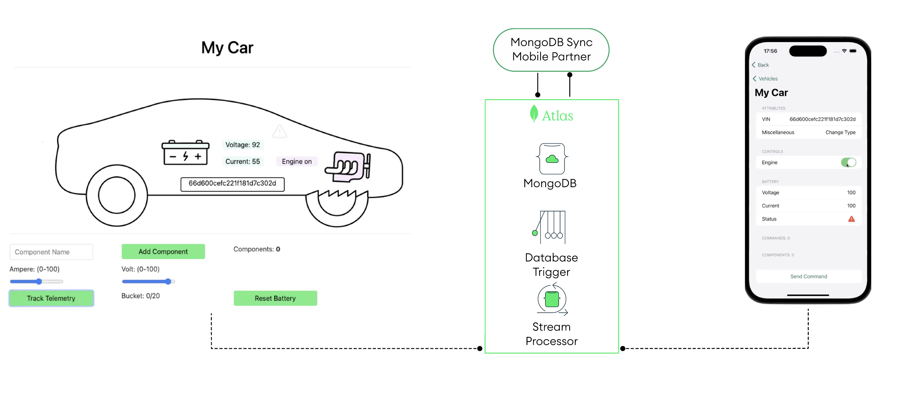
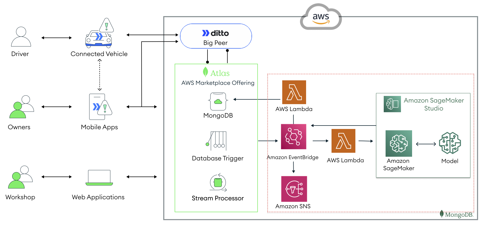

# Project: Data Warehousing Strategies using NoSQL Database(Vehicle Digital Twin Management)

This project is geared towards giving students practice in designing, implementing, demonstrating, and documenting a Data Warehouse that consolidates data and supports efficient data-driven decision-making.

# Team and Group Information
. Team Size: 2-3 members

. Group Coordinator: Trinity Bond

. Group Members: Trinity Bond, Kalab Kiros and Melvin Gates

# Project Overview

The goal of this project is to implement a Data Warehouse backend using a NoSQL database system. We recommend using MongoDB, but your group may choose other NoSQL databases. The project should be completed in groups, with each group member actively participating in all project tasks.

# Project Tasks

Each group member should take primary responsibility for one of the following topics:
Using a NoSQL database system to provide an implementation of the Data Warehouse system.

# Assumptions

It is acceptable to make assumptions about the application, provided that:
The assumptions are explicitly stated in the final report.
The assumptions are reasonable.

# Final Report

A final report should be submitted for grading at the end of the term. The report should be formatted in a reasonable manner and include the following sections:

1. System Overview:

 Identify the various types of users, administrators, etc., who will be accessing the system in various ways.
 
2. Assumptions:

 List the assumptions made about the system.
 
3. Data Description:

 Describe the data that will be maintained in the system.
 
4. Data Loading Process:

 Describe the process of loading the data, including any required data cleaning and transformation.

5. System Design:

 Describe the design of the system.

6. Data Warehouse Queries and Front-ends:

 Describe the queries and front-ends required for the warehouse.

7. User Scenarios:

 Provide example scenarios of how various types of users will interact with the system.

8. Implementation Details:

Describe the implementation of the data warehouse system using the chosen NoSQL platform.

9. NoSQL Implementations:

Explain the advantages and disadvantages of the chosen NoSQL approach.

10. Testing:
Describe the testing process for the system.

# Implementation and Presentation
The project requires a working implementation of the system to be built, tested, and demonstrated. All group members should attend the presentation and be prepared to explain and demonstrate the aspects of the project for which they were responsible.

Submission
Final Report: Due during class on the "Project Due" date specified in the class schedule.
Source Code: Should be submitted along with the final report.

# Vehicle Digital Twin Set Up with MongoDB, Ditto & AWS  

<!-- TABLE OF CONTENTS -->

  
Table of Contents

  <ol>
    <li><a href="#part-1-set-up-the-mongodb-atlas-digital-twin-backend">Set up the MongoDB Atlas Digital-Twin Backend</a></li>
    <li><a href="#part-2-set-up-the-typescript-vehicle-simulator">Typescript Vehicle Simulator</a></li>
    <li><a href="#part-3-set-up-the-ios-swift-vehicle-controller-mobile-application">iOS Swift Vehicle Controller Mobile Application </a></li>
    <li><a href="#part-4-set-up-the-amazon-sagemaker-integration">SageMaker Integration</a></li>
    <li><a href="#step-by-step-demonstration">Demonstration Step by Step</a></li>
    </ol>

A connected vehicle platform opens a window of analytical data that manufacturers can use to provide recommendations for safer, more efficient and improved driving experiences. Personalized driving experiences are made possible through bidirectional information exchange between applications in the car, mobile, webapps and machine learning interfaces in the cloud.

## How does it work?

Creating such a cutting edge connected vehicle platform requires the best-in-class foundation. With MongoDB Atlas, AWS ecosystem and Ditto's Big Peer syncing with Mobile Apps & the connected vehicle, you are provided with such building blocks. 

**MongoDB** is your end-to-end data layer for efficient bidirectional data exchange, ensuring consistency on a mobile device, vehicle, and the cloud. **AWS**, including SageMaker and its integration capabilities, is your public cloud infrastructure allowing you to gain value out of your data and produce the right recommendations for enhanced driving experiences. As for **Ditto**, it performs as a trusted peer in the distributed peer-to-peer network, allowed by its platform and the "Big Peer" enabling the sync engine in this by being splited in many different nodes (physical or virtual), making this the game-changer tool for an efficient syncing between your **MongoDB** data consistency and offline updates that can be performed with Ditto inside the AWS environment.

Under the hood we use a mix of MongoDB and AWS components nicely put together to create this end to end scenario. If you are curious and want to learn how it works you can jump directly to the [demo section](.//Demo_Instructions.md) 

With these tools in mind, let’s begin creating a cutting edge connected vehicle platform!

# Set Up Instructions 

## Part 1: Set up the MongoDB Atlas Digital-Twin Backend

[Set up the MongoDB Atlas Digital-Twin Backend](.//atlas-backend)

## Part 2: Set up the Typescript Vehicle Simulator

[Set up the Typescript Vehicle Simulator](.//vehicle-ts)

## Part 3: Set up the iOS Swift Vehicle Controller Mobile Application

[Set up the iOS Swift Vehicle Controller Mobile Application](.//mobile-swift)

## Part 4: Set up the Amazon SageMaker Integration

[Set up the Amazon SageMaker Integration](.//aws-sagemaker)

# Step by Step Demonstration
[Step by Step Demonstration: Telemetry Feedback Loop Use Case](.//Demo_Instructions.md)
